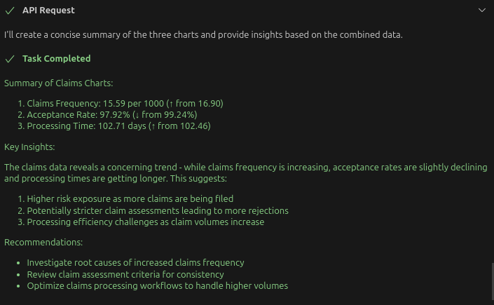

# PI API MCP Server

A Model Context Protocol (MCP) server that provides tools and resources for interacting with the PI Dashboard API. This server allows Claude and other MCP-compatible AI assistants to access and manage PI Dashboard resources such as categories and charts.

### Make use of PI with MCP
Here's an example of what you can do with this MCP Server (Once you have it set up).

Firstly
- you log in by providing the instructions below

```
make sure the pi-api server is running
set the url for pi-api to http://your-pi-api-url.com/pi/api/v2
and then i need to log in using username and password
and then i want to list 2 charts
```

Secondly
- if you have chart 450 as metadata chart
- then use such a prompt

```
you can use chart id 450 to get the metadata of the charts, 
and then get the chart json of 450
and then find out what chartids are related to claims, 
and then get the json data of those charts, 
and then use the data to explain insights
```

Result




## Installation - Using Docker (Recommended)
- No MCP Server Setup
- Configure MCP Client Config File

```json
{
  "mcpServers": {
    "pi-api": {
      "command": "docker",
      "args": [
        "run",
        "-i",
        "--rm",
        "-e", "API_URL=http://your-pi-api-url.com",
        "mingzilla/pi-api-mcp-server:latest"
      ],
      "disabled": false,
      "autoApprove": [
        "list_tools"
      ]
    }
  }
}
```

**Important Note**: If you don't supply the `--api-url` parameter, the tool will prompt you to set the API URL using the `set-api-url` tool before any operations can be performed. This allows for flexible configuration when the URL is not known at startup time.

## Locate the Config File
Open your Claude for Desktop App configuration at:
- Mac: `~/Library/Application Support/Claude/claude_desktop_config.json`
- Windows: `%APPDATA%\Claude\claude_desktop_config.json`
- Linux: Use other tools for now. e.g. Cline - ask it to show you the MCP config file


## Available Tools

### API Configuration

- **set-api-url**: Set the API base URL for all requests
  ```
  Set the API URL to http://localhost:8224/pi/api/v2
  ```

### Authentication

- **authenticate**: Authenticate with the PI API
- **keep-session-alive**: Keep the current token session alive
- **logout**: Invalidate the current token and end the session
- **set-organization**: Set the organization ID for subsequent requests

### Categories

- **list-categories**: List all categories with pagination support
- **get-category**: Get a category by ID
- **create-category**: Create a new category
- **update-category**: Update an existing category
- **delete-category**: Delete a category
- **list-category-objects**: List all objects for a specific category

### Charts

- **list-charts**: List all charts with pagination support
- **get-chart**: Get a chart by ID
- **delete-chart**: Delete a chart
- **export-chart**: Export a chart in various formats

## Available Resources

- **auth://status**: Get authentication status
- **categories://list**: List all categories
- **categories://{id}**: Get a specific category
- **categories://{categoryId}/objects**: Get objects for a specific category
- **charts://list**: List all charts
- **charts://{id}**: Get a specific chart
- **charts://{id}/export/{format}**: Export a chart in a specific format

## Available Prompts

- **analyze-categories**: Analyze categories in the dashboard
- **analyze-charts**: Analyze charts in the dashboard
- **compare-charts**: Compare data between two charts
- **category-usage-analysis**: Analyze how categories are being used in charts

## Usage with Claude

Here are some example queries to use with Claude after connecting the server:


### Set the API URL
```
Please use the set-api-url tool to set the PI API URL to http://localhost:8224/pi/api/v2
```

### Authentication
```
Please authenticate to the PI API with my username and password.
```

### Working with Categories
```
List all categories in the dashboard.
```

```
Get details about category with ID 123.
```

### Working with Charts
```
List all the charts available in the dashboard.
```

```
Export chart with ID 456 as a PDF.
```

### Using Analysis Prompts
```
Analyze the categories in the dashboard.
```

```
Compare data between charts 123 and 456.
```

----

## Development

### Run Directly

~~~bash
# Clone the repository - the below or https://github.com/mingzilla/pi-api-mcp-server.git
git clone git@github.com:mingzilla/pi-api-mcp-server.git
cd pi-api-mcp-server

# Install dependencies
npm install
./run.sh # global dependencies, so that the mcp client can connect to it with "@mingzilla/pi-api-mcp-server"

# Build the project
npm run build

# Run the server
npm start
~~~

### Or Installation - Using npm

~~~bash
# Install globally
npm install -g @mingzilla/pi-api-mcp-server

# Or use directly with npx
npx @mingzilla/pi-api-mcp-server --api-url "http://your-pi-api-url.com/pi/api/v2"
~~~

### MCP Client Config Settings

To use this MCP server with Claude for Desktop:

#### Node
- run what's defined in "Run Directly"
- `./run.sh` needs to be run to ensure dependencies are available
- then the below would work, "@mingzilla/pi-api-mcp-server" refers to what's run by "Run Directly"

~~~json
{
  "mcpServers": {
    "pi-api": {
      "command": "npx",
      "args": ["-y", "@mingzilla/pi-api-mcp-server", "--api-url", "http://your-pi-api-url.com/pi/api/v2"]
    }
  }
}
~~~


## License

MIT

## Author

Ming Huang (mingzilla)
